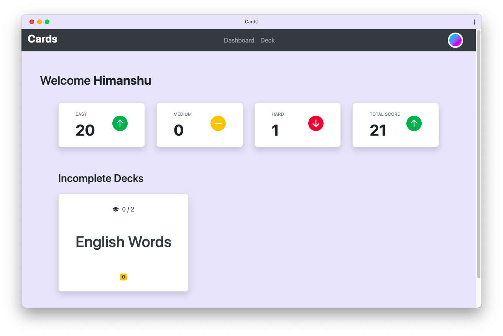

# Cards &middot; [](https://github.com/flxhq/cards.flask.vue/actions/workflows/codeql.yml)

This repository contains Python, VueJS and other Files for Cards App.



### Features
- Modular Architecture
    - Flask
    - VueJS
    - Celery
    - Bootstrap
    - SQLAlchemy
- Progressive Web App (PWA)
- Responsive Web Design

### External Softwares.
1. Redis DB
2. [MailHog](https://github.com/mailhog/MailHog)

### Configurations

> Default configurations can be found in `app/config.py` file. Update them as required.

### Instructions to run the app

### Server
#### Server Setup

```bash
pipenv install
```

#### Run the Server

```bash
gunicorn main:app
```

#### Start Celery beat for periodic task

```bash
celery -A main.celery beat --max-interval 1 -l info
```

#### Run Celery Workers.

```bash
celery -A main.celery worker -l info
```

### Client
#### Client Setup

```bash
yarn install
```

#### Serve the Client

```bash
yarn serve
```

#### Login Credentials
```
username: admin@cards.com
password: password
```

Finally, Open [Cards](http://localhost:8080) in your browser.